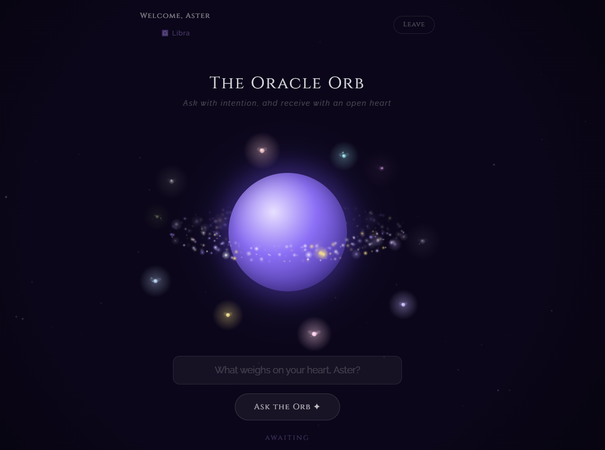

# 🔮 The Oracle Orb

A mystical AI-powered oracle web app built with React, Node.js, and the Groq AI API. Ask the orb anything — it responds with poetic, personalized wisdom based on your question's emotional tone.

**[✦ Live Demo →](https://your-oracle-orb-url.vercel.app)**

---

## ✨ Features

- 🌌 **Animated glowing orb** with a live milky way galaxy rendered in canvas
- 💫 **4-layer planetary star rings** rotating like Saturn's rings
- 🧚 **Enchanted faeries** with glowing wings, sparkles and light trails that gather when you ask a question
- 🎨 **Mood detection** — orb color shifts based on the emotion of your question (sad, joyful, love, angry, mysterious and more)
- ✨ **Ripple shockwave** bursts from the orb when the answer is revealed
- ⌨️ **Typewriter effect** — answers appear letter by letter
- 🔊 **Ambient music** that plays during the experience
- 🌫️ **Atmospheric fog** that shifts color with each mood
- 📋 **Personalized experience** — enter your name, date of birth, time and place of birth for personalized answers
- ♈ **Zodiac detection** from date of birth
- 💾 **Remembers you** — saves your profile in localStorage
- 📱 **Fully mobile responsive**

---

## 🛠️ Tech Stack

| Layer | Technology |
|-------|-----------|
| Frontend | React + Vite |
| Animations | HTML5 Canvas API |
| Backend | Node.js + Express |
| AI | Groq API (Llama 3.3 70B) |
| Deployment | Vercel |
| Styling | Inline React styles + CSS animations |

---

## 📸 Preview

> 
---

## 🚀 Running Locally

```bash
# 1. Clone the repo
git clone https://github.com/YOUR_USERNAME/oracle-orb.git
cd oracle-orb

# 2. Install dependencies
npm install

# 3. Create .env file in root
echo "GROQ_API_KEY=your_key_here" > .env

# 4. Start the backend (Terminal 1)
node server.js

# 5. Start the frontend (Terminal 2)
npm run dev

# 6. Open http://localhost:5173
```

> Get a free Groq API key at [console.groq.com](https://console.groq.com)

---

## 💡 How It Works

1. User enters their name and birth details on the registration screen
2. On the oracle screen, they type a question and click **Ask the Orb**
3. The app detects the emotional mood of the question
4. Faeries animate inward as the orb shifts color to match the mood
5. The question is sent to the Groq API with the user's birth context
6. A ripple shockwave fires and the answer types itself out

---

## 🎨 Mood System

| Mood | Trigger Words | Orb Color |
|------|--------------|-----------|
| Melancholy | sad, grief, heartbreak, lonely | Cold blue |
| Joyful | happy, excited, celebrate | Warm gold |
| Loving | love, romance, partner | Rose pink |
| Fierce | angry, rage, furious | Ember red |
| Mysterious | secret, dream, prophecy | Teal cyan |
| Natural | forest, ocean, nature | Emerald green |
| Analytical | code, science, math | Electric blue |
| Wise | meaning, universe, truth | Amber gold |

---

## 👤 Author

**Your Name**
- Portfolio: [your-portfolio.com](https://your-portfolio.com)
- LinkedIn: [linkedin.com/in/yourname](https://linkedin.com/in/yourname)
- GitHub: [@yourusername](https://github.com/yourusername)

---

*Built with intention ✦ and a little cosmic magic*